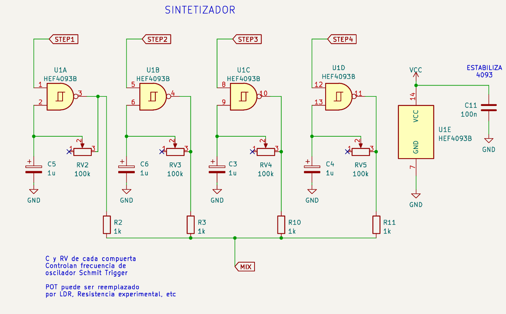
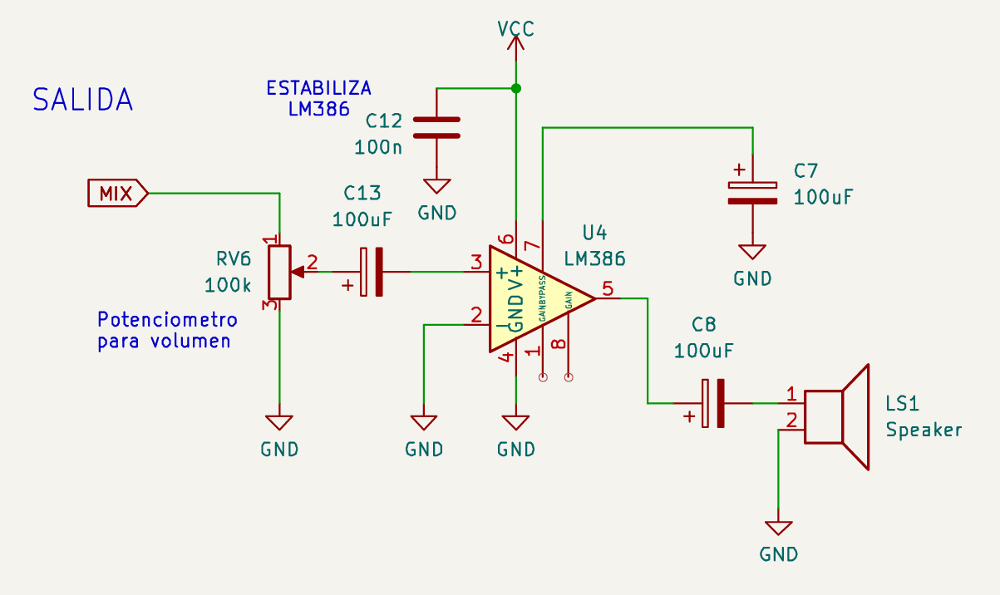
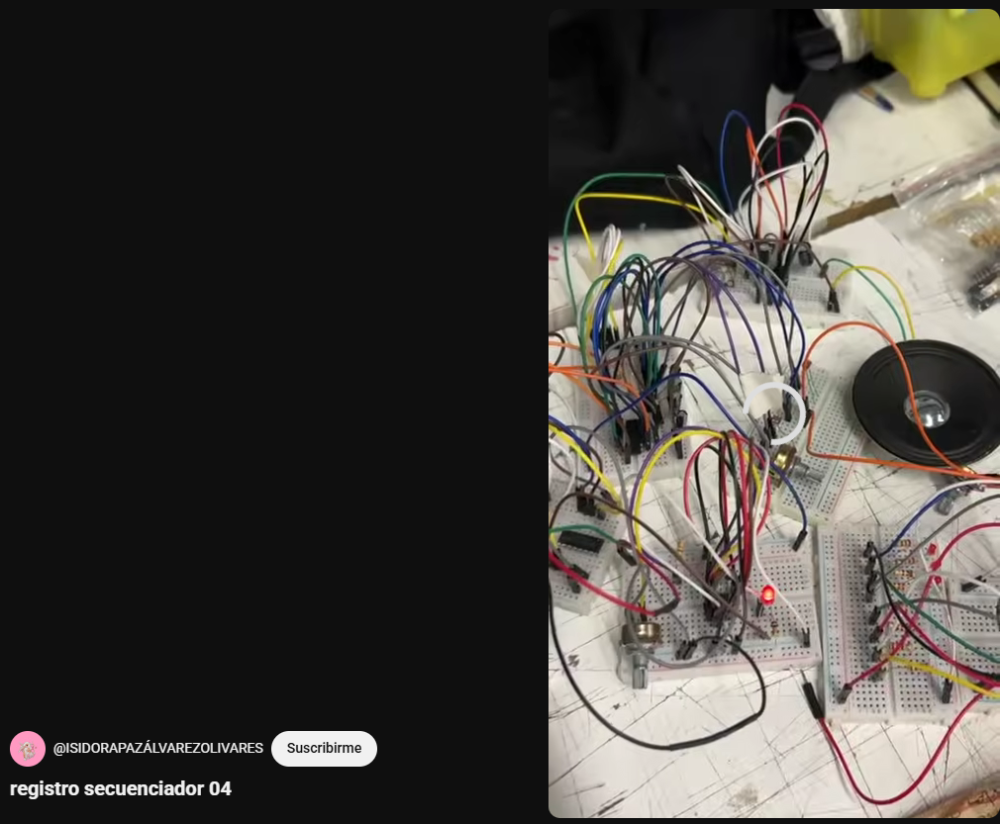
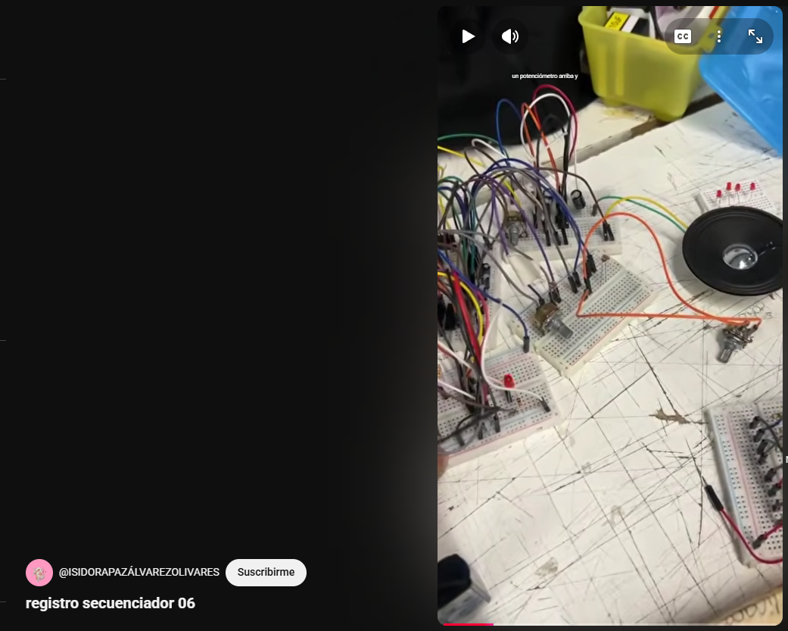
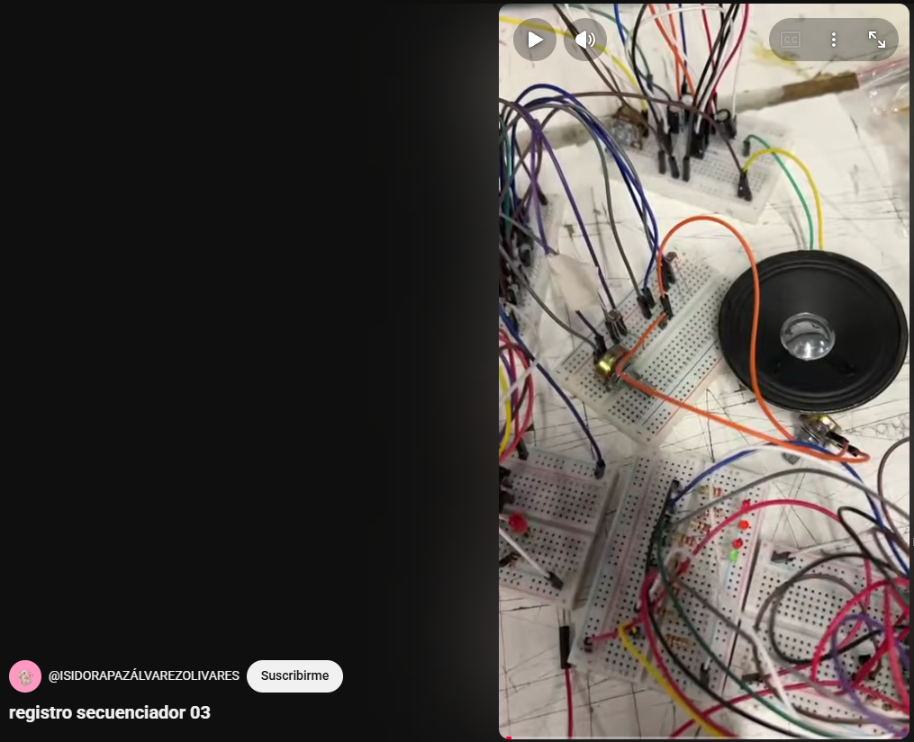
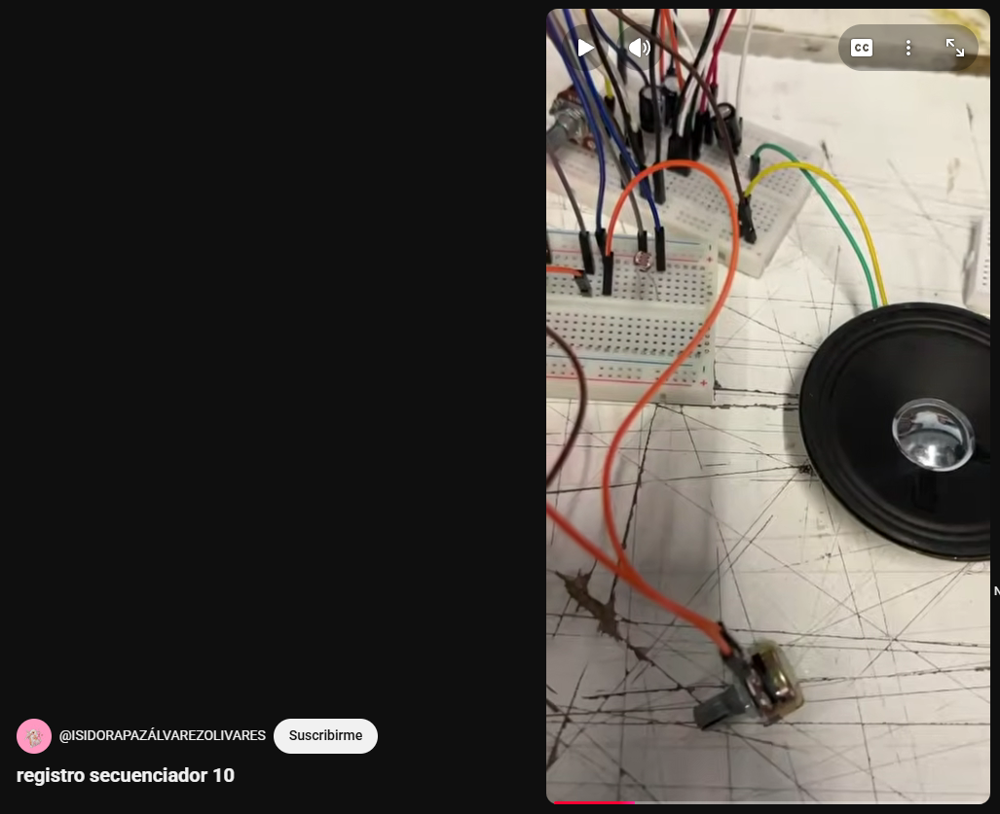
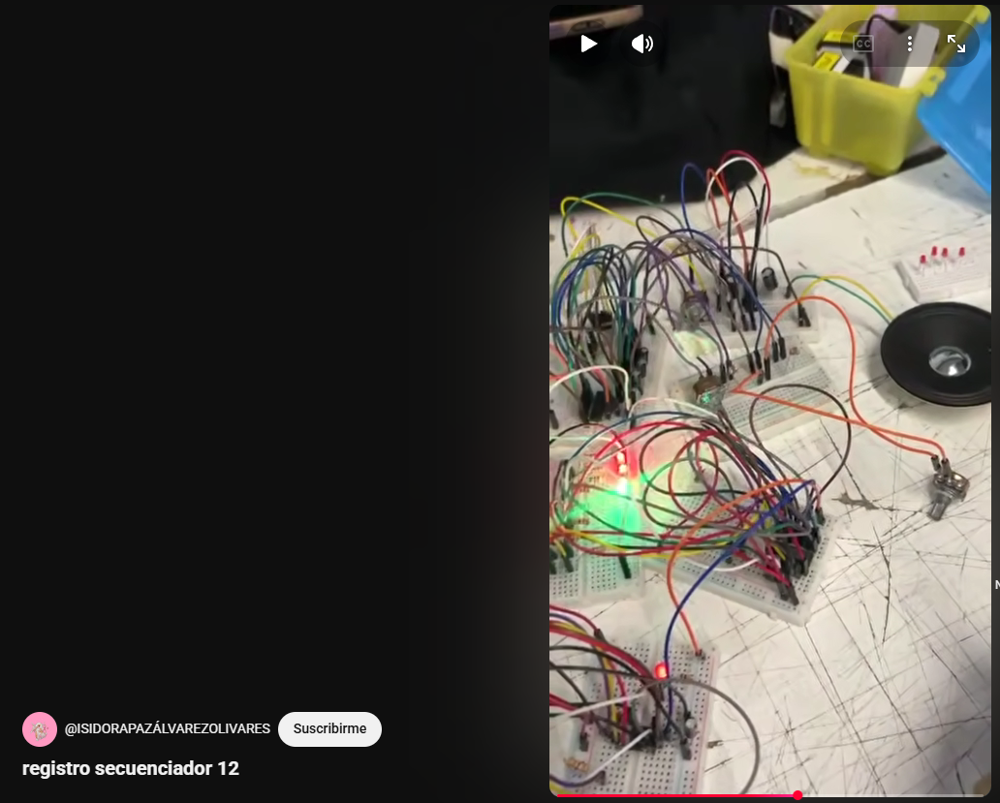
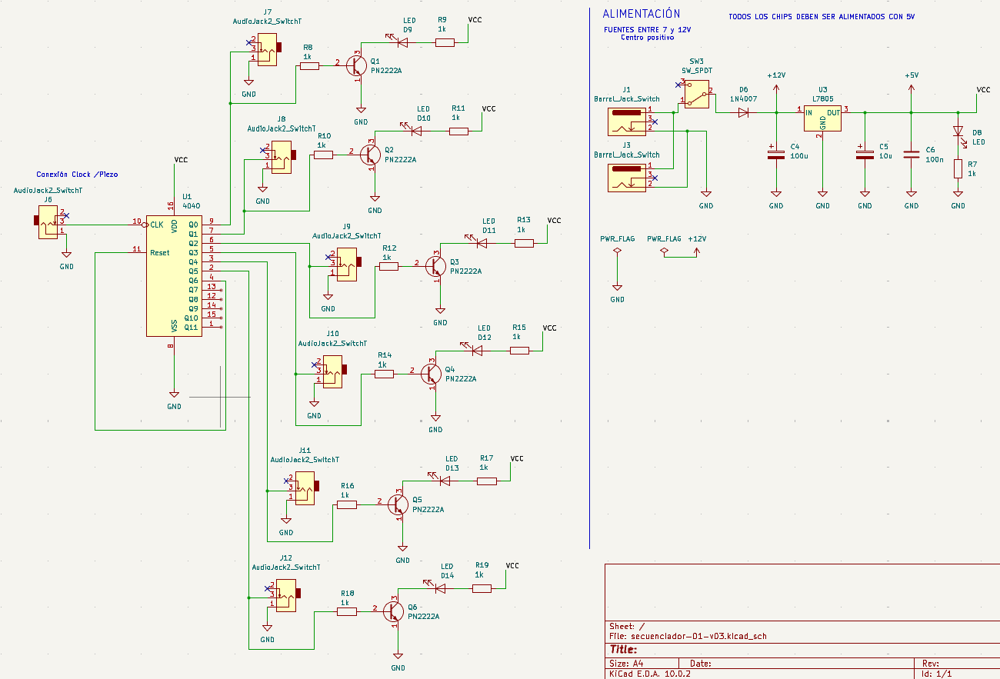
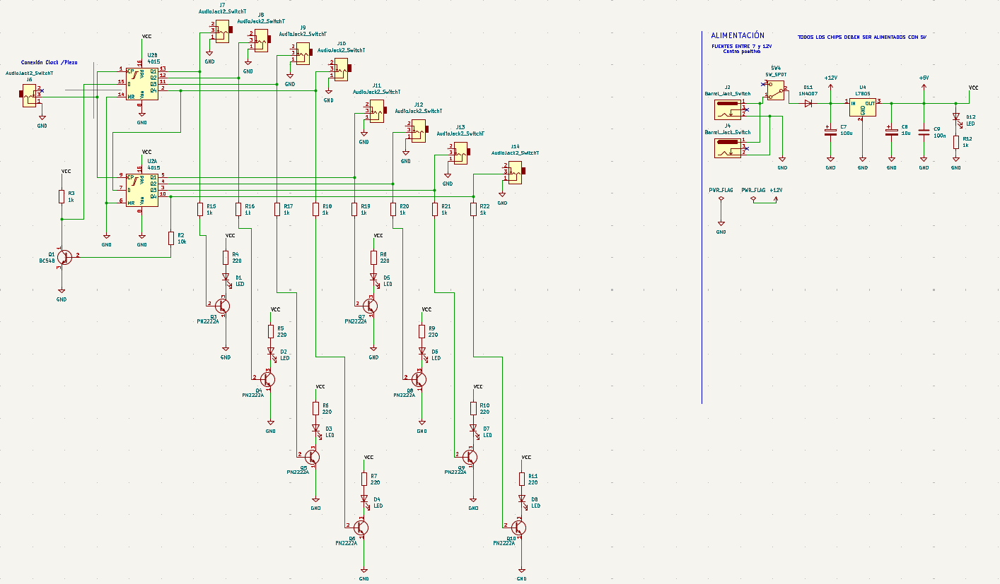

# sesion-12a

## Clase

Realizamos las pruebas de transistores en los diversos circuitos, además de la conexión de los secuenciadores a un VCO y un amplificador. Pero primero vamos por partes como dijo jack el destripador

### 1. Sonido

Ya que un secuenciador no genera sonido, conectamos un VCO en base a un 4093 el cual llega a un amplificador basado en un LM386

> Se cambiaron 2 potenciometros por LDR, ya que no teniamos suficientes potenciometros

 

Al incluir estos se logró identificar _el patrín ritmico_ que se puede lograr al usar secuenciadores en abse a chips 4040 y 4015

#### Secuenciador Binario / CD4040

 

#### Secuenciador en Ola / CD4015

 

Esto no fue algo que llevara mucho tiempo, ya que se establecio que Dayana e Isidora iban a llegar con las protoboard listas para conectar

Además de tener practica en la revisión de estos circuitos fue algo muy ameno

 

### Transistores 

Luego de múltiples revisiones, tanto propias como del equipo docente, se llegó a un resultado favorable en la inclusión de transistores 2N2222

#### CD4040

 

#### CD4015

 

El funcionamiento es relativamente sencillo: El led se encuentra conectado a VCC y a GND (con su respectiva resistencia), entre medio está conectado al emisor y el colector del transistor, además de la base de este llega al Q correspondiente (o tambien llamado paso). Por lo que cada vez que Q manda una señal termina activando al transistor en modo switch, cerrando el circuito y prendiendo el led

 

## Post Clase

El trabajo se centró en 2 puntos:

- Fabricación protoboard IC CD4040 y CD4015 con transistores

- Documentación

En lo personal me centré en corregir y establecer un estilo único a la documentación, además de complementar ideas y cargar archivos correspondientes. Fue complejo porque me encontraba bastante resfriada y con pocas horas de sueño por entregas de otros cursos 
