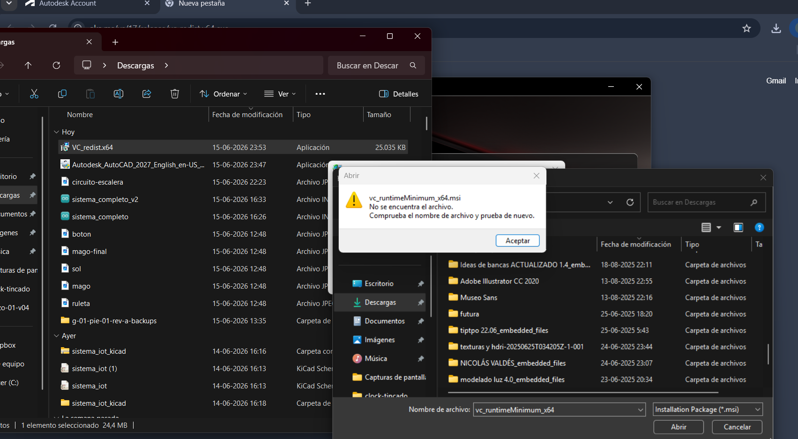
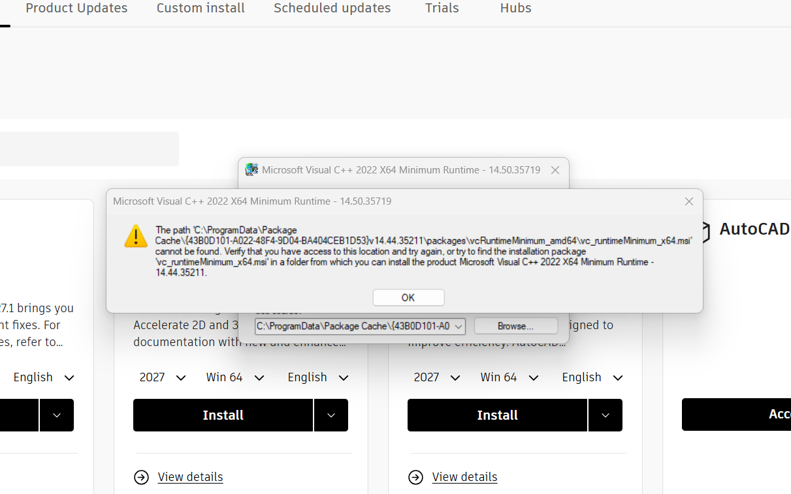
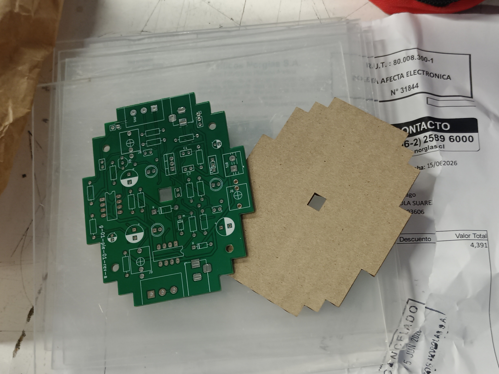
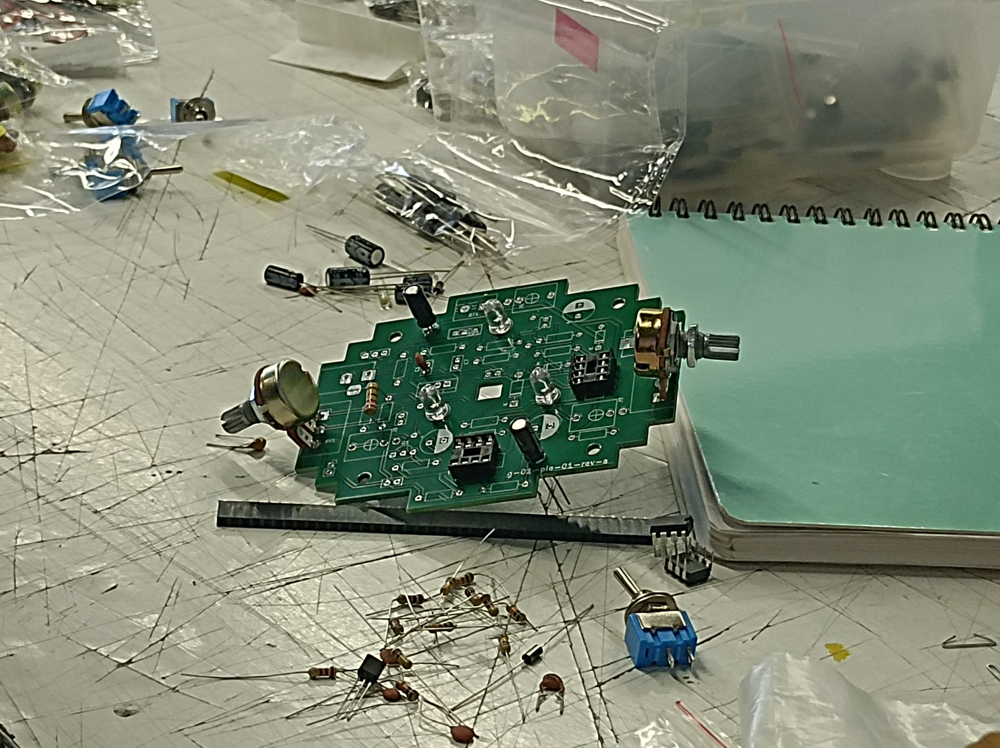
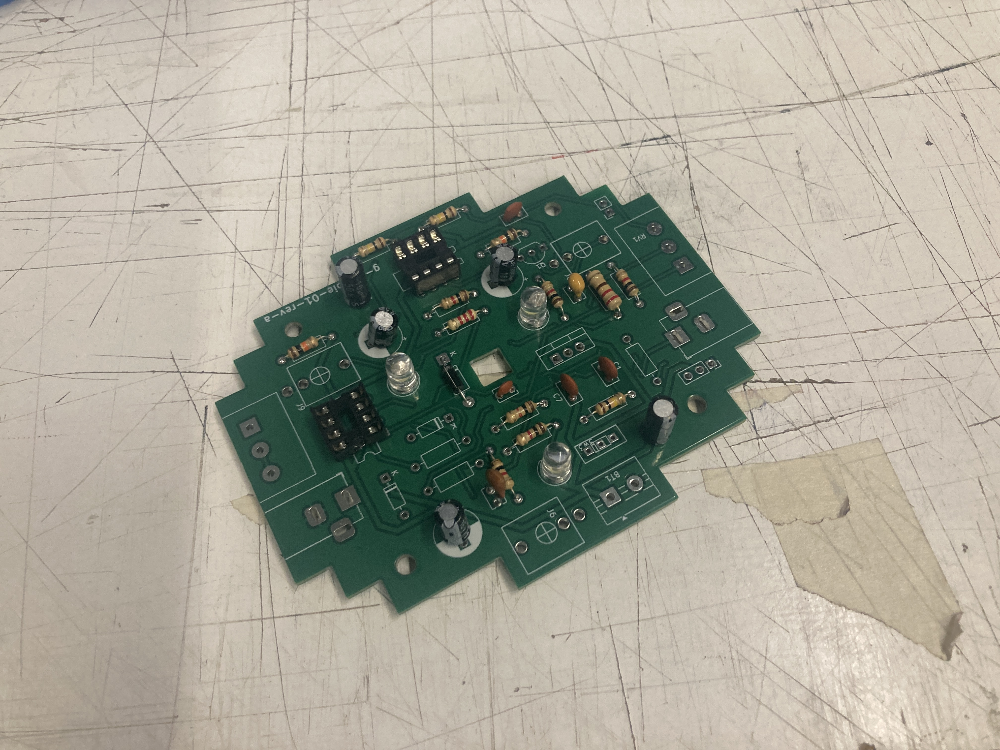
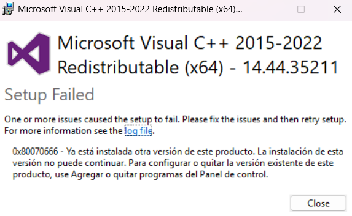
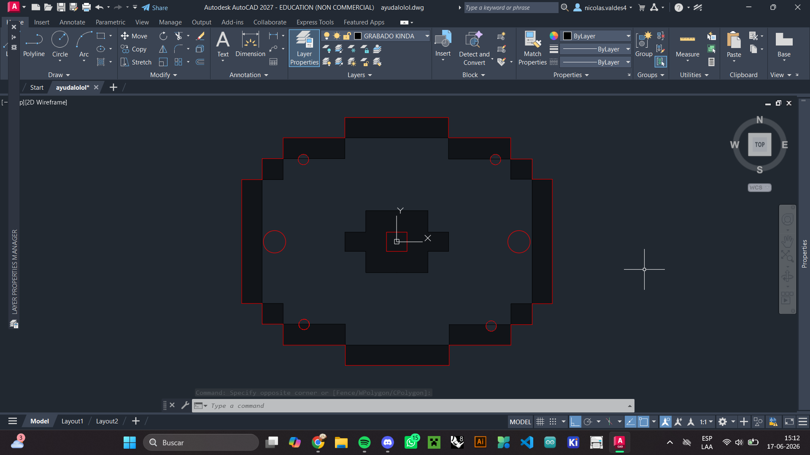

# sesion-14a

# Clase 16/06

El 15 llegaron las PCB!! entré a la sala para la clase de interacciones inalámbricas y Aarón tenía las PCB fuera de la caja. Nos dijo que las abramos para verlas y fue hermoso, ya que es la primera vez que hacemos PCB y verlas en nuestras propias manos fue maravilloso. Cuando vi a nuestra guagua (Maincra) fue como cuando una madre ve a su hijo por primera vez y lo encuentra el ser más hermoso de la tierra a pesar de que no lo sea, lo cual disfruté por todo un día hasta que lo volví a ver el martes y me dejó de parecer lindo debido al color, pero eso no importa porque lo vamos a solucionar con el acrílico JEJEJEJE.

Partimos la clase viendo el esquemático de la PCB Relo, la cual sería la primera PCB que soldaríamos para así practicar y no partir al tiro con nuestras PCB. Con mi grupo sacamos algunos de los componentes que necesitábamos para el Relo y fuimos a ver qué estaba pasando al frente de la sala, en donde Aarón nos dijo que nos pusiéramos a soldar entonces eso hicimos(? XD. Aarón me enseñó como soldar bien y no a pura fe como lo hacía antes de este día, en donde aprendí lo siguiente:

1. Prender el cautín y esperar a que llegue a su temperatura máxima, la cual la indica en la pantalla si es que son los cautines cuicos.
2. Calentar el componente con el cautín, y apoyarse sin miedo ya que no pasará nada malo.
3. Mientras está el cautín en el componente, acercar el estaño y se empezará a derretir para hacer la soldadura.
4. Una vez ya se haya hecho la soldadura, retirar primero el estaño y luego el cautín para que no se quede pegado el estaño a la soldadura.
5. En caso de que se hayan unido dos puntos mediante el estaño, mantener el cautín en un punto y se separarán de manera natural.

Luego de aprender a como soldar de manera correcta, compartí mi conocimiento con otros compañeros. Cuando aprendieron, empezaron a soldar sus cosas así que me fui con mi grupo para ver qué podíamos hacer mientras esperábamos a que se desocupe algún cautín, en donde decidimos probar el archivo de corte que yo había hecho en la noche para el acrílico, a lo que recomendé probar con otro material en vez de ir directo con el material final ya que no estaba seguro de si el archivo que había hecho estaba bien. Para probar si estaba bien, fui al primer piso y saqué un cartón que estaba tirado en el lado de las escaleras del auditorio (ahí siempre hay material tirado, así que asumí que no era de nadie ya que no tenía nombre) y fui al pañol digital a ver si podía colarme en una hora de corte láser ya que nuestro archivo era algo pequeñito que no tomaría ni 5 minutos, a lo que me dijeron que sí y cuando terminó el corte los tíos me dijeron que salía gratis porque no se demoró nada la máquina (muy humildes, lo aprecio).

Cuando subí a la sala le mostré el cómo quedó el cartón a mis compañeros y les gustó, pero yo igual quería arreglar el archivo ya que faltaban los hoyos para los pernos y para los potenciómetros lo cual no pude hacer ya que mi idea era hacer todo esto en AutoCAD para que sea todo más preciso, pero por alguna razón mi pc empezó a rechazar esa idea y me causó problemas al tratar de actualizar mi licencia de estudiante, en donde me mostraba el siguiente enunciado:

Como no pude resolver este problema, me vi obligado a hacer el archivo en Illustrator (BUUU ADOBE BUUU :tomato: :tomato:) y no me atrevía a hacer los hoyos ya que podía quedar chueco, y el más mínimo error milimétrico podía dejar todo chueco, así que solo quedaba luchar, pero eso era problema para el Nicolás del futuro. De momento, el corte quedó así:

Como ya habíamos practicado soldar, decidimos poner los componentes en nuestra placa y soldarlos. 

Para soldar tuvimos que hacer un poquito de fila, lo que nos dio tiempo para verificar si los componentes estaban bien puestos. El primer componente que se soldó fue la camita para el chip 555, en donde apareció Aarón y nos dijo que lo soldamos al revés XD así que le hizo un hoyito al otro lado para que nos guiemos de eso cuando ubiquemos el chip.

Al final todo el día fue sobre soldar, lo cual fue muy entretenido. La PCB que estuvimos soldando finalmente quedó así:

Foto tomada por chknngttts, agradecido por su donación a mi bitácora.

---

# LUCHA CON AUTOCAD.... o con mi pc, no lo sé. Tal vez es una lucha conmigo mismo. Ayuda?

Como mostré anteriormente, al momento de intentar descargar nuevamente AutoCAD me tiraba ese error, por lo que intenté volver a descargar el archivo ``VC_redist.x64``, pero al momento de instalarlo me mostraba el siguiente error:

Como no funcionaba, me empecé a desesperar y busqué ayuda en foros random, en donde me decían que tenía que eliminar muchos archivos asi que confié (probablemente no debí, pero esta vez no pasó nada malo asi que agradezco a la gente que no me trolleó) y borré todo lo que me decían. Ya no recuerdo mucho, pero sé que uno de los archivos empezaba con ``{43B0D101-A0...}``, el cual lo anoté ya que le tuve que preguntar a mi primo (que sabe muchas cosas y asumí que de esto tambiénXD) si estaba bien que lo eliminara, a lo que me dijo que si ya que es solo caché. Borré la carpeta, y no me ayudó ya que volvía a tirar el mismo error.

Como estaba cayendo en la locura ya que no entendía nada, descargué también el archivo ``VC_redist.x86`` el cual al momento de hacer la instalación no me dio ningún error y me dio esperanza, así que reinicié mi pc y volví a intentar instalar AutoCAD Y FUNCIONÓ!!! no sé qué hace ese archivo, pero le agradezco que exista.

Cuando ya tenía AutoCAD y era feliz, decidí hacer un nuevo archivo de corte utilizando el mismo archivo de KiCad para que quede exactamente igual a la PCB. Para lograr esto hice lo siguiente:

1. En el Editor de placa de nuestro KiCad seleccioné la opción de ``Archivo`` -> ``Exportar`` -> ``STEP/GLB/BREP/XAO/PLY/STL...`` y exporté el archivo como .STL
2. Ya teniendo el archivo .STL, lo abrí en Rhino 8, en donde retiré los componentes y utilicé el comando ``make 2d`` para poder obtener solo las curvas de corte de la PCB.
3. Como ya tenía las curvas, solo quedaba exportar el archivo .3dm a .dwg, lo cual se hace en ``Archivo`` -> ``Exportar`` y buscas la opción de ``dibujo de autocad (dwg)``
4. Una vez ya en AutoCAD, cambié los valores de línea y los colores para que estén listos para cortar en la máquina.

Cuando terminé, el archivo quedó así:

